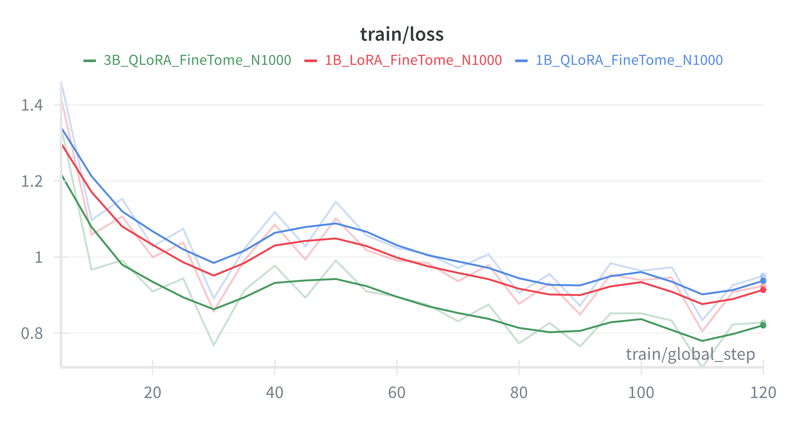

# 🔧 Parameter-Efficient Fine-Tuning of Llama 3.2

> **Lab 2 Report** – Scalable Machine Learning & Deep Learning

## Authors

- [Jacopo Bennati](https://github.com/jacobbista)
- [Pawat Songkhopanit](https://github.com/sunnypawat)

## 📌 Objective

Apply **Parameter-Efficient Fine-Tuning (PEFT)** techniques to modern LLMs under strict compute constraints, demonstrating measurable performance improvements in instruction following while maintaining CPU inference capability.

### Key Focus Areas

| Component      | Details                        |
| -------------- | ------------------------------ |
| **Models**     | Llama 3.2 (1B & 3B parameters) |
| **Techniques** | LoRA and QLoRA adapters        |
| **Inference**  | CPU-only via GGUF + llama.cpp  |
| **Evaluation** | LLM-as-a-Judge (GPT-4o-mini)   |

---

## ⚙️ Setup & Installation

### Prerequisites

| Component   | Details                             |
| ----------- | ----------------------------------- |
| Hardware    | Local RTX 4070 / Google Colab (T4)  |
| Base Model  | Llama-3.2-1B-Instruct / 3B-Instruct |
| Fine-tuning | Unsloth (QLoRA rank=16)             |
| Tracking    | Weights & Biases (W&B)              |

### Environment Variables

Create a `.env` file with your credentials:

```bash
cp env.template .env
```

Required keys:

- `HF_TOKEN`: Hugging Face Write Token
- `WANDB_API_KEY`: Weights & Biases API Key
- `OPENAI_API_KEY`: OpenAI API Key (for evaluation)

### Installation

Best if you use conda to create a new environment and install the dependencies there. This is the recommended way to install the dependencies.
**Option 1: Conda**

```bash
conda create -n lab2-llm python=3.10
conda activate lab2-llm
pip install -r requirements.txt
```

**Option 2: Pip**

```bash
pip install -r requirements.txt
```

---

## 🧪 Methodology

### Dataset

We utilize **FineTome-100k**, a high-quality instruction-response dataset.

- **Train Split:** 1,000 samples (first portion)
- **Eval Split:** 20 held-out samples (immediately following training region)
- **Format:** Alpaca-style instruction template

### Training Configuration

Training was performed using **Unsloth** for optimized memory usage.

| Parameter         | Value       | Notes                                |
| ----------------- | ----------- | ------------------------------------ |
| Max Steps         | 120         | ~0.5 epochs (undertraining observed) |
| Batch Size        | 1           |                                      |
| Grad Accumulation | 4           | Effective Batch Size = 4             |
| Learning Rate     | 2e-4        |                                      |
| Optimizer         | AdamW 8-bit |                                      |
| LoRA Rank (r)     | 16          |                                      |
| Quantization      | Q4_K_M      | Used for final GGUF export           |

### Models Trained

We fine-tuned four variants to compare against baselines:

| Model ID   | Base Model            | Method | Goal             |
| ---------- | --------------------- | ------ | ---------------- |
| `base_1b`  | Llama-3.2-1B-Instruct | None   | Baseline         |
| `base_3b`  | Llama-3.2-3B-Instruct | None   | Baseline         |
| `1b_lora`  | Llama-3.2-1B-Instruct | LoRA   | Experimental     |
| `1b_qlora` | Llama-3.2-1B-Instruct | QLoRA  | Experimental     |
| `3b_qlora` | Llama-3.2-3B-Instruct | QLoRA  | Best Performance |

---

## 🧠 Evaluation

We implemented an **LLM-as-a-Judge** pipeline using GPT-4o-mini. The judge evaluates model outputs on a scale of 1–5 based on:

- Correctness
- Completeness
- Faithfulness to instruction

### Quantitative Results

| Model      | Avg Score | Δ vs Baseline | Status             |
| ---------- | --------- | ------------- | ------------------ |
| `3b_qlora` | 3.65      | ⬆ +0.05       | Slight Improvement |
| `base_3b`  | 3.60      | —             | Baseline           |
| `base_1b`  | 3.60      | —             | Baseline           |
| `1b_qlora` | 3.35      | ⬇ -0.25       | Regression         |
| `1b_lora`  | 3.15      | ⬇ -0.45       | Regression         |

---

## 🔍 Analysis & Insights

We analyzed the training telemetry via **Weights & Biases** to understand the performance gap between the 1B and 3B models. The training dynamics provide the clearest explanation for the evaluation results.


_Figure: Training loss curves for Llama-3.2 1B (Orange) and 3B (Blue) over 120 steps (Gaussian Smoothing)._

### 1. Training Dynamics: The "Undertraining" Factor

The loss curves for both models were still **decreasing steeply** at step 120.

- **Data Seen:** The models only processed ~480 samples out of the available 1,000 (< 0.5 epochs).
- **Impact:** The training was effectively "interrupted" during the initial adaptation phase. This prevented the models from solidifying new instruction-following patterns and reaching convergence.
- **Insight:** To reach a loss plateau and realize the dataset's full potential, training should be extended to at least **500 steps (~2 epochs)**.

> 🔗 [View full training logs on Weights & Biases](https://wandb.ai/jacobbista-kth-royal-institute-of-technology/lab2-peft)

### 2. Model-Centric Analysis

Comparing the two architectures reveals a trade-off between robustness and sensitivity:

| Model              | Behavior              | Explanation                                                                                    |
| ------------------ | --------------------- | ---------------------------------------------------------------------------------------------- |
| **3B (Robust)**    | Smooth loss reduction | Handled aggressive LR (2e-4) without destabilizing. Maintained baseline and improved slightly. |
| **1B (Sensitive)** | Regression (-0.45)    | High LR caused weight oscillation instead of convergence. "Forgetting" pre-trained knowledge.  |

**Correction strategy:** For 1B models, use a lower learning rate (e.g., `5e-5`) to prevent catastrophic forgetting.

### 3. Data-Centric Analysis

Despite the short training duration, data quality played a crucial role:

- **High-Quality Source:** FineTome-100k provided superior instruction diversity compared to standard synthetic datasets.
- **Strict Formatting:** Rigid Alpaca templates reduced hallucinations in format compliance, ensuring the models learned structure even before mastering content.

---

## 🛰 Deployment

The final models were exported to **GGUF format** for CPU inference.

### Local Inference

```bash
python app.py
```

### Hugging Face Space

The best performing model (`3B QLoRA`) is deployed via a Gradio frontend.

- 🔗 **Model Repo (1B QLoRA):** [HuggingFace Link](https://huggingface.co/jacobbista/llama3-1b-finetome/tree/1B_QLoRA_N1000)
- 🔗 **Model Repo (1B LoRA):** [HuggingFace Link](https://huggingface.co/jacobbista/llama3-1b-finetome/tree/1B_LoRA_N1000)
- 🔗 **Model Repo (3B QLoRA):** [HuggingFace Link](https://huggingface.co/jacobbista/llama3-3b-finetome/tree/3B_QLoRA_N1000)
- 🔗 **Demo:** [Gradio Space Link](https://huggingface.co/spaces/sunnypawat/iris)

---

## 🏁 Conclusion

> **Key Takeaway:** PEFT is viable for consumer hardware, but training duration matters.

A **3B QLoRA model** showed the best potential. However, the 1B model's performance drop highlights the need for:

- **Lower Learning Rates** for smaller models (e.g., 5e-5)
- **Longer Training:** At least 1-2 full epochs are required to converge beyond the initial "unlearning" phase

---
